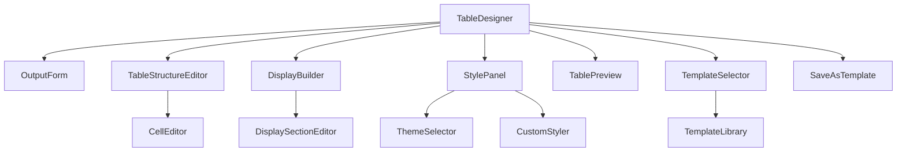

# Table Designer Components

A comprehensive React-based table designer for creating clinical trial tables with drag-and-drop functionality, real-time preview, and clinical standards compliance.

## Overview

The Table Designer is a sophisticated suite of components that enables users to create, edit, and manage clinical trial tables through an intuitive interface. It supports templates, custom styling, and follows clinical table standards.

## Architecture

```
TableDesigner/
├── TableDesigner.tsx          # Main container component
├── OutputForm.tsx             # Basic output details form
├── DisplayBuilder.tsx         # Manages table displays
├── DisplaySectionEditor.tsx   # Editor for display sections
├── TableStructureEditor.tsx   # Table structure definition
├── CellEditor.tsx            # Individual cell configuration
├── TablePreview.tsx          # Live preview component
├── Templates/                # Template-related components
│   ├── TemplateSelector.tsx
│   ├── TemplateLibrary.tsx
│   └── SaveAsTemplate.tsx
├── Styling/                  # Styling components
│   ├── StylePanel.tsx
│   ├── ThemeSelector.tsx
│   └── CustomStyler.tsx
└── index.ts                  # Component exports
```

## Core Components

### TableDesigner (Main Container)

The primary component that orchestrates the entire table design workflow.

**Features:**
- Step-based workflow (Basic Details → Structure → Display)
- Drag-and-drop interface
- Real-time preview
- Template integration
- Styling panel
- Auto-save capabilities

**Props:**
- `outputId?: string` - ID of existing output to edit
- `onSave?: (output: Output) => void` - Save callback
- `onCancel?: () => void` - Cancel callback

### OutputForm

Handles basic output information and file specifications.

**Features:**
- Output metadata (name, description, version)
- File specifications management
- Multiple output formats support
- Validation

### DisplayBuilder

Manages the creation and organization of table displays.

**Features:**
- Multiple display support
- Drag-and-drop reordering
- Display duplication
- Section management
- Preview functionality

### DisplaySectionEditor

Advanced editor for configuring display sections.

**Features:**
- Section type management (Header, Title, Body, Footer, etc.)
- Sub-section editing
- Drag-and-drop reordering
- Text content editing
- Section preview

### TableStructureEditor

Defines the table structure with columns and rows.

**Features:**
- Column management (data types, alignment, formatting)
- Row management (types, ordering)
- Cell editing interface
- Structure preview
- Drag-and-drop reordering

### CellEditor

Individual cell configuration with rich editing capabilities.

**Features:**
- Content editing by data type
- Style customization
- Metadata management
- Formula support
- Preview

### TablePreview

Live preview of the table design.

**Features:**
- Multiple format previews (HTML, PDF, RTF)
- Zoom controls
- Export functionality
- Print support
- Fullscreen mode

## Template System

### TemplateSelector

Quick template selection interface.

**Features:**
- Categorized templates
- Search and filtering
- Favorites management
- Template preview
- Usage statistics

### TemplateLibrary

Comprehensive template browsing and management.

**Features:**
- Public, organization, and personal templates
- Template ratings and downloads
- Upload functionality
- Version management
- Sharing capabilities

### SaveAsTemplate

Template creation from existing designs.

**Features:**
- Metadata configuration
- Tag management
- License selection
- Public/private sharing
- Documentation support

## Styling System

### StylePanel

Main styling control panel.

**Features:**
- Theme selection
- Typography controls
- Layout options
- Color management
- Live preview
- CSS generation

### ThemeSelector

Pre-defined theme selection.

**Features:**
- Clinical standard themes
- Regulatory compliance themes
- Custom themes
- Theme preview
- Category organization

### CustomStyler

Granular style customization.

**Features:**
- Typography controls
- Color palette management
- Layout spacing
- Border and padding
- Real-time preview

## Data Flow



## State Management

The components use a combination of:
- Local component state for UI interactions
- Custom hooks (`useOutput`) for business logic
- React Context for shared state
- Props drilling for component communication

### useOutput Hook

Central hook for output management:

```typescript
const {
  output,
  loading,
  saving,
  updateOutput,
  saveOutput,
  validateOutput,
  exportOutput,
  loadTemplate,
  saveAsTemplate
} = useOutput(outputId)
```

## Integration Points

### API Integration

- `outputService.ts` - Comprehensive API service
- RESTful endpoints for CRUD operations
- Template management
- Export/import functionality
- Validation services

### External Dependencies

- `react-dnd` - Drag and drop functionality
- `antd` - UI component library
- `moment` - Date handling
- React Router - Navigation

## Usage Examples

### Basic Usage

```typescript
import { TableDesigner } from './components/TableDesigner'

function App() {
  return (
    <TableDesigner
      onSave={(output) => console.log('Saved:', output)}
      onCancel={() => console.log('Cancelled')}
    />
  )
}
```

### Edit Existing Output

```typescript
<TableDesigner
  outputId="output-123"
  onSave={handleSave}
  onCancel={handleCancel}
/>
```

### Embedded Mode

```typescript
<TableDesigner
  embedded={true}
  onSave={handleSave}
  onCancel={handleCancel}
/>
```

## Clinical Standards Compliance

The table designer supports various clinical standards:

- **ICH E3** - Clinical study reports
- **FDA** - Regulatory submission requirements
- **EMA** - European regulatory standards
- **CDISC** - Clinical data standards

### Standard Features

- Predefined table templates
- Compliant formatting options
- Validation rules
- Export formats
- Terminology integration

## Accessibility

- WCAG 2.1 AA compliance
- Keyboard navigation support
- Screen reader compatibility
- High contrast themes
- Focus management

## Performance Considerations

- Lazy loading of components
- Virtualization for large datasets
- Memoization for expensive operations
- Debounced auto-save
- Optimized re-renders

## Testing Strategy

### Unit Tests
- Component rendering
- Event handling
- Hook functionality
- Utility functions

### Integration Tests
- Component interaction
- API integration
- State management
- User workflows

### E2E Tests
- Complete user journeys
- Cross-browser compatibility
- Performance testing
- Accessibility testing

## Browser Support

- Chrome 80+
- Firefox 75+
- Safari 13+
- Edge 80+

## Future Enhancements

### Planned Features
- Real-time collaboration
- Version control
- Advanced charting
- Data source integration
- AI-powered suggestions

### Performance Improvements
- Virtual scrolling
- Web Workers for processing
- Progressive loading
- Caching strategies

## Contributing

### Development Setup

1. Install dependencies:
   ```bash
   npm install
   ```

2. Start development server:
   ```bash
   npm run dev
   ```

3. Run tests:
   ```bash
   npm test
   ```

### Code Standards

- TypeScript strict mode
- ESLint configuration
- Prettier formatting
- Conventional commits

### Component Guidelines

- Use functional components with hooks
- Implement proper TypeScript typing
- Include comprehensive prop documentation
- Follow accessibility best practices
- Write unit tests for all components

## Troubleshooting

### Common Issues

1. **Drag and drop not working**
   - Ensure react-dnd-html5-backend is properly installed
   - Check DndProvider wrapper

2. **Styles not applying**
   - Verify CSS imports
   - Check theme configuration

3. **Template loading fails**
   - Verify API endpoints
   - Check authentication

4. **Preview generation errors**
   - Validate output structure
   - Check export service configuration

### Performance Issues

- Use React DevTools Profiler
- Monitor bundle size
- Check for memory leaks
- Optimize re-renders

## API Reference

### Props Interface

```typescript
interface TableDesignerProps {
  outputId?: string
  onSave?: (output: Output) => void
  onCancel?: () => void
  embedded?: boolean
}
```

### Hook Returns

```typescript
interface UseOutputReturn {
  output: Output | null
  loading: boolean
  saving: boolean
  updateOutput: (updates: Partial<Output>) => void
  saveOutput: () => Promise<Output | null>
  // ... additional methods
}
```

## License

This component library is part of the ARS (Analysis Results Standard) project and follows the project's licensing terms.